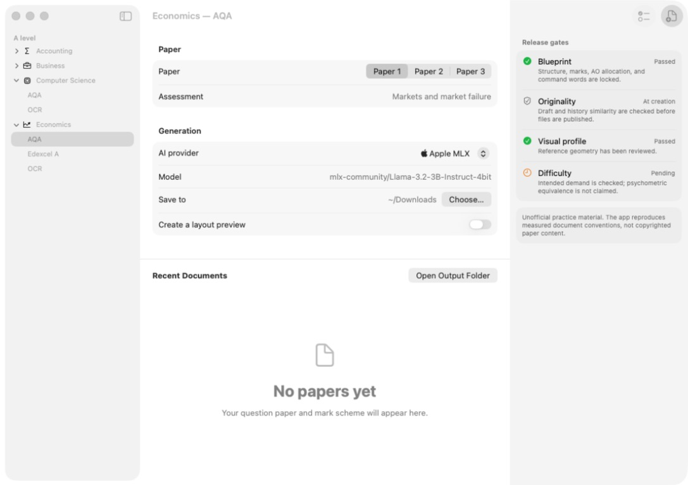
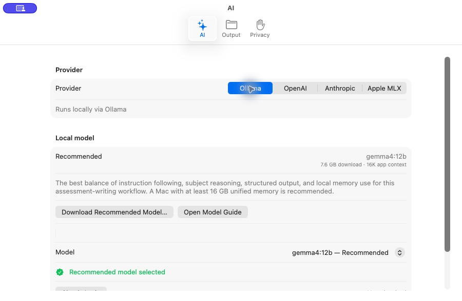

# macOS UI audit

Date: 22 August 2026

## Scope and method

The current Debug app was built with strict concurrency and warnings-as-errors,
then inspected through the macOS accessibility tree and fresh screenshots. The
workspace and AI Settings were checked at the same window sizes as the saved
baseline. Screenshot review supports visible-layout findings only; it does not
by itself prove accessibility compliance.

## Final workspace

The main window uses a native three-column `NavigationSplitView`: subject and
board navigation, the paper-creation task, and a collapsible quality inspector.
The hierarchy, alignment, grouping, toolbar placement, empty state, and
resizable geometry follow macOS system conventions. Release status is
communicated with both symbols and text, not colour alone.

## AI Settings

Settings use the standard Settings scene and toolbar-style tabs. The Ollama
pane places the hardware-aware recommendation before the model picker, shows
download and app-context size, exposes model installation/status actions, and
shows an explicit symbol-and-text warning whenever another model is selected.

## Help and onboarding

The optional welcome sheet explains the core workflow without blocking later
access. The Help window uses a native split view with Getting Started, Choosing
a Model, Creating a Paper, Checking Quality, Privacy, Troubleshooting, and
Shortcuts topics. Current workspace and AI Settings captures are shipped as
tutorial images rather than placeholders.

## HIG findings

- Native controls, system fonts, semantic colours, SF Symbols, standard focus
  behaviour, grouped forms, tables, toolbars, Settings, and keyboard commands
  are used instead of web-style custom controls.
- The main action occupies the primary toolbar position. `Command-Return`
  creates, `Command-Period` cancels, `Command-Comma` opens Settings, and
  `Shift-Command-H` opens app help.
- Disabled states provide a nearby recovery reason. Progress is determinate
  whenever the backend supplies a fraction and cancellation is available.
- Output uses a user-selected folder, native recent-document actions, Finder
  reveal/open/drag behaviour, and sandbox bookmarks in the App Store build.
- Settings are immediate and task-local paper choices remain in the main flow.

## Required hands-on release checks

Source and accessibility-tree inspection confirm semantic labels and native
control structure, but the release owner must still exercise VoiceOver, Full
Keyboard Access, Increase Contrast, Reduce Transparency, light/dark appearance,
large text, long localisation, minimum/large window sizes, and generation error
and cancellation states on the distribution build.
